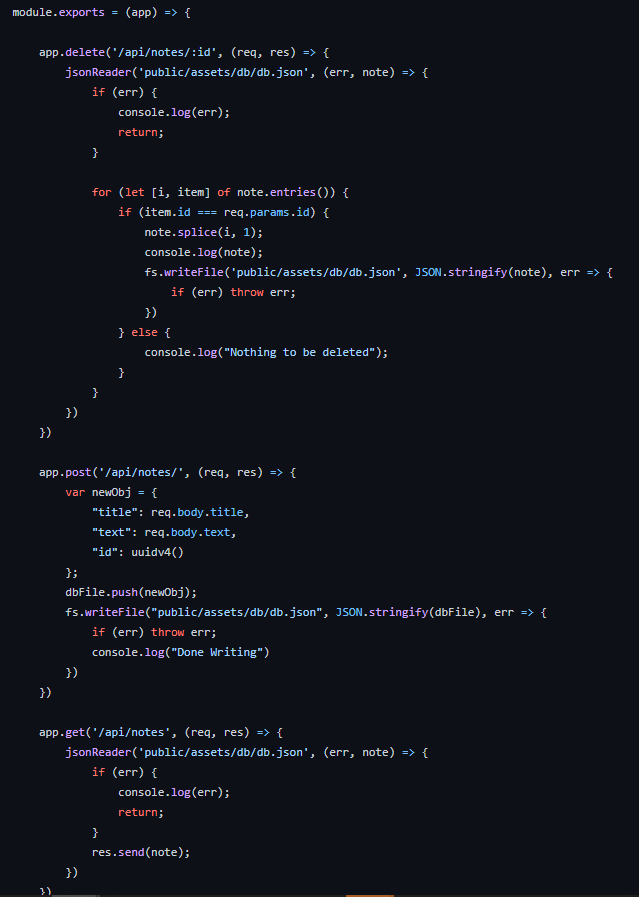

# Note Taker Application 

Heroku Deployment: https://mysterious-hamlet-58917.herokuapp.com/

Github Repository: https://github.com/Seanmonaghan/note_taker

[Description](#description) 

[Installation Instructions](#installation-instructions) 

[Site Overview](#site-overview) 

[License](#license)  

[Contribution Guidelines](#contribution-guidelines) 
 
[Questions](#questions)

## Description

This application's purpose is to help the user keep track of their busy life by allowing them to write and save notes.  This application utilizes Express.js for the back end and will save and retrieve note data from a JSON file.

The front end of the application is built using HTML, CSS and the Bootstrap framework, and is deployed via Heroku.

The Ideal user of this application is someone who has a lot to do and lost their blackberry.  This app will keep all of your important duties written down in a nice format for you to come back to and delete once you've been productive.  

## Installation Instructions

This app is already deployed via Heroku so there is no need to install on your local device.  

If you are interested in doing so, simply clone or fork the project to your local device and install the Node Modules with a 'npm i' as they are all listed as dependencies in the package.json.
 

## Site Overview

[Video Link to Application Overview](https://drive.google.com/file/d/1JlGndw7mq_XuKe3hd9z4QBMmcBXqaM4g/view?usp=sharing)

The above video overviews how the app is used by the user.  The user can input text into the boxes with the placeholder 'Note Title' and 'Note Text' and then a save icon will appear on the top right of the screen which will write the information provided onto the db.json file, as well as render it upon the left hand side of the screen as a saved note after a refresh.  

If the user clicks on one of the saved notes, it will become the active note and be displayed in a readonly manner on the right hand side of the screen.  

If the user wants to write another note, they can click on the pencil icon on the top right of the screen to create a new note.  

If the user wants to delete a note, they can click on the delete icon to the right of the listed note and this will delete it from the list which will be reflected after a refresh.  

## License

This application uses the MIT license

## Contribution Guidelines

If you would like to contribute to this project feel free to send requests.  I only wish that you be respectful to other contributes and to the code itself and maintain good clean coding practices.  

## Questions

If you have any questions about the application, be sure to contact me at my [e-mail](mailto:smonagha@conncoll.edu)

Alternatively you can find me and my other works at my [Github account](https://github.com/seanmonaghan)

